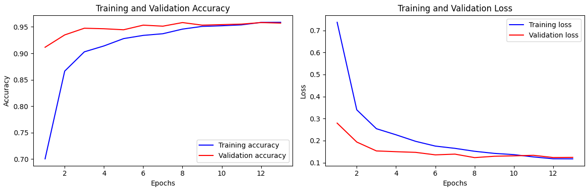
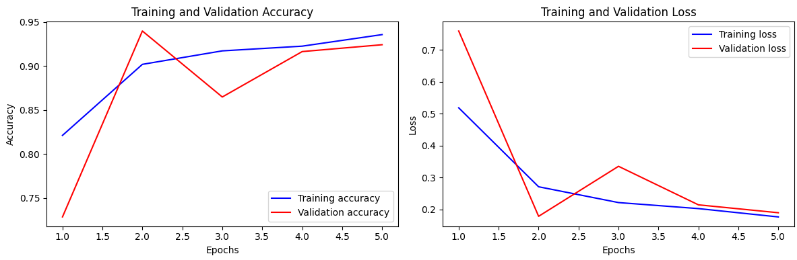
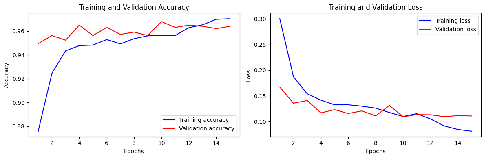

# COVID-19-Classification-from-Chest-X-ray-Images

## Description :books:
In this study, we will use [Chest X-ray Image(COVID19, PNEUMONIA, and NORMAL)](https://www.kaggle.com/datasets/alsaniipe/chest-x-ray-image) dataset from Kaggle,
which includes samples labeled as COVID-19, pneumonia, and normal cases.  
The dataset will be split into training, validation, and test sets to ensure a fair evaluation of the model’s generalization ability.  
To assess the performance of each model, we will employ a confusion matrix, which provides detailed insights into the precision and recall.  
This will help us evaluate how well the model distinguishes between COVID-19 and other classes. The results will be
presented with the following metrics derived from the confusion matrix:  
- **Accuracy**: The percentage of correctly classified samples across all categories.
- **Precision**: Indicates how many of the predicted positive cases are actually positive.
- **Recall**: Reflects how many of the actual positive cases were correctly identified by the model.
    
## Methods and Approach :bulb:
- Model Selection  
    In this research, we will utilize three deep learning architectures:
    - ResNet
    - DenseNet
    - EfficientNet  
  These models have demonstrated state-of-the-art performance in image classification tasks, and stacking them allows us to leverage their complementary strengths.
- Training Process and Performance 
  Each pre-trained model (ResNet50, DenseNet, EfficientNetB0) was loaded with ImageNet weights. The base model
was frozen during initial training, allowing only the custom layers to be optimized. After training, evaluation metrics
such as accuracy, precision, recall, F1-score, and inference time were computed on the test set to compare models.
The training accuracy of ResNet50, DenseNet, and EfficientNetB0 over epochs is visualized in Figure 1, Figure 2,
and Figure 3. Early stopping triggered at different epochs for each model reflects their learning dynamics.

  - **ResNet50**:
  
  - **DensesNet**:
  
  - **EfficientNet**:
  
- Testing Performance  
Each model’s performance was evaluated on the test set using precision, recall, and F1-score metrics. The classification reports are detailed in Table 1.

## Technologies :desktop_computer:
  
  
  

Other Technologies: Numpy, Pandas, Seaborn, matpolotlib
## Future work :memo:
- Experimenting with additional deep learning architectures such as InceptionV3, MobileNet, or Vision Transformers
(ViTs)
- Implement data preprocessing methods such as normalization, augmentation, and contrast enhancement
- Build essembly model by stacking various models to enhance accuracy
